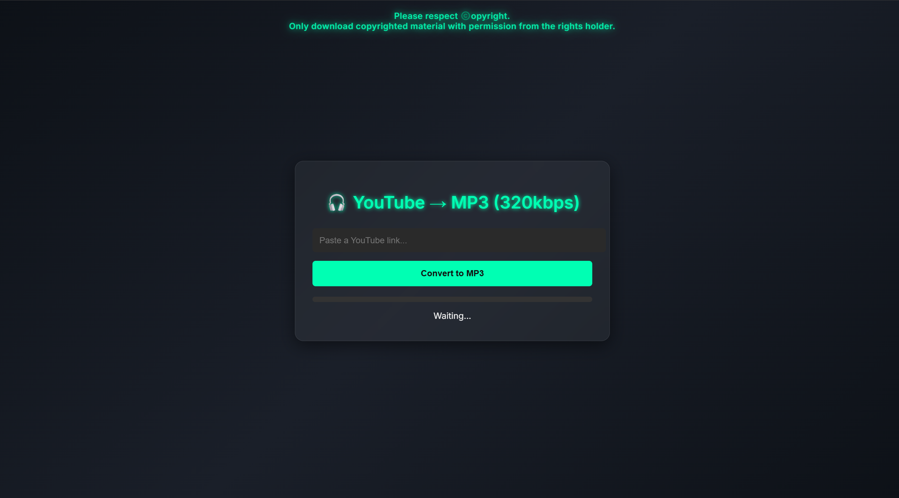
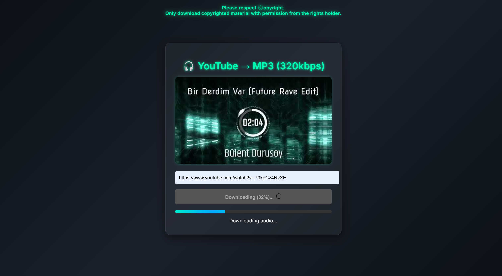
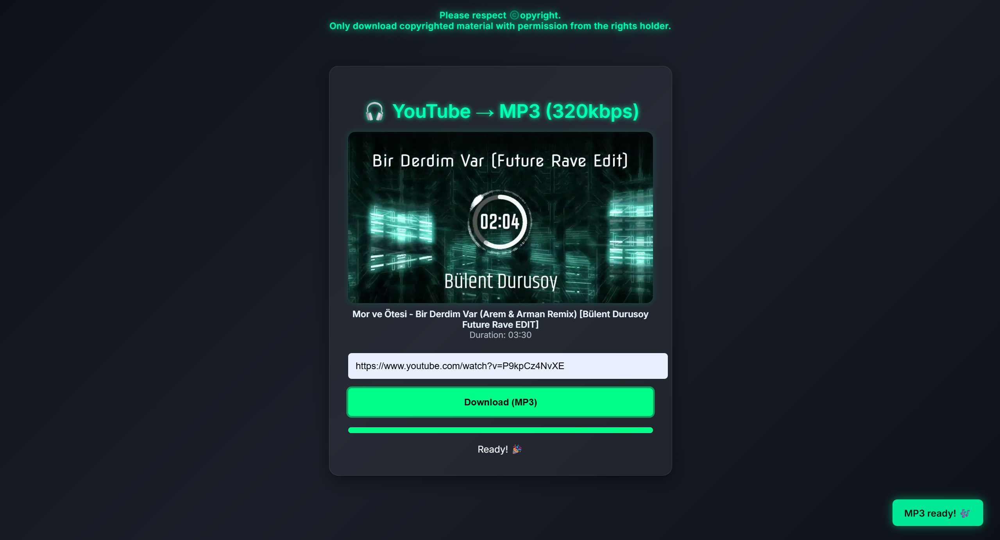

# YouTube to MP3 (320kbps) Converter

A fast and high-quality YouTube to MP3 converter focused on clean UI, reliability, and 320 kbps audio output.

This project is designed as a production-ready web application with an emphasis on performance, user experience, and audio quality.

## Live Demo

https://youtube320mp3.com

## Features

- Convert YouTube videos to MP3 (up to 320 kbps)
- High-quality audio output
- Fast processing
- No registration required
- Mobile-friendly and responsive UI
- Thumbnail and metadata preview
- Progress tracking and status updates
- Live stream detection and blocking
- Maintenance mode handling
- Single-video support (no playlists or channels)

## Screenshots

  

  

  

## Technology Overview

This repository intentionally does **not** include backend source code.

High-level stack overview:

- Frontend: HTML, CSS, JavaScript
- Backend: Custom server-side processing (private)
- Audio Processing: FFmpeg-based pipeline
- Hosting: Self-hosted infrastructure

Implementation details, internal APIs, and processing logic are kept private by design.

## Project Structure

This repository serves as a public showcase and documentation reference for the project.

